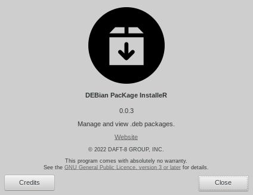

# DEBian PAcKage InstalleR

_debpakir_ is a application for install, uninstall or view deb packages.

_It is currently a work in progress. Maintenance is done by <a href="https://www.github.com/DAFT-8/">DAFT-8</a> team._

## Dependencies

* This application is developed based on Python3 and GTK+3. Dependencies:
  * ```gir1.2-glib-2.0 gir1.2-gtk-3.0 gir1.2-notify-0.7 dh-python python3-all python3-apt```

## Run Application from Source

* Install dependencies :
  * ```sudo apt install gir1.2-glib-2.0 gir1.2-gtk-3.0 gir1.2-notify-0.7 dh-python python3-all python3-apt```
* Clone the repository :
  * ```git clone https://github.com/DAFT-8/debpakir.git ~/debpakir```
* Run application :
  * ```python3 ~/debpakir/src/main.py```

## Build the package

* `sudo apt install devscripts git-buildpackage`
* `cd ~/debpakir/`
* `sudo mk-build-deps -ir`
* `gbp buildpackage --git-ignore-new -us -uc`

## Screenshot(s)


